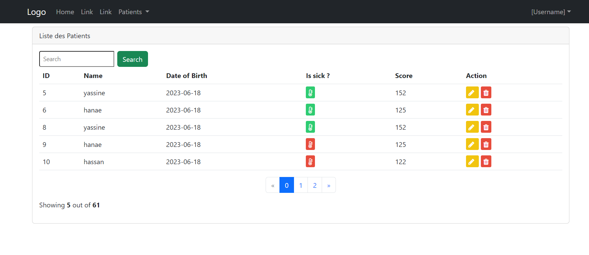

#  Spring-boot-mvc-thymeleaf-data

This project is a web application for managing patient records. It allows users to view, add, update, and delete patient information.

## Interfaces

### Interface 1: Show All Patients "http://localhost:port/index"

The "Show All Patients" page displays a list of all patients in the database. Users can view patient details and edit or delete individual records.

### Interface 2: Search "http://localhost:port/index?keywor=yassine"

The index page also has a search functionnality.

### Interface 3: Add a New Patient "http://localhost:port/formPatient"

The "Add a New Patient" page allows users to add a new patient record to the database.

### Interface 4: Update an Existing Patient "http://localhost:port/editPatient?id=9"

The "Update Patient" page allows users to edit an existing patient record in the database.

### Interface 5: Delete an existing patient "http://localhost:port/delete?id=15"

Delete and existing patient with confirmation.

